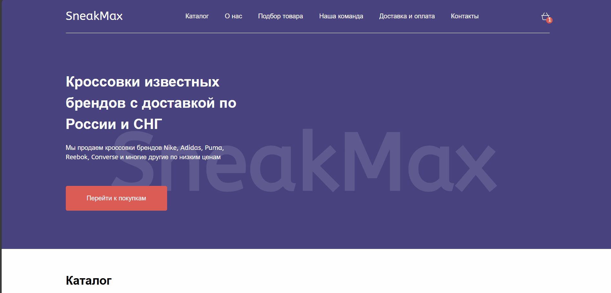
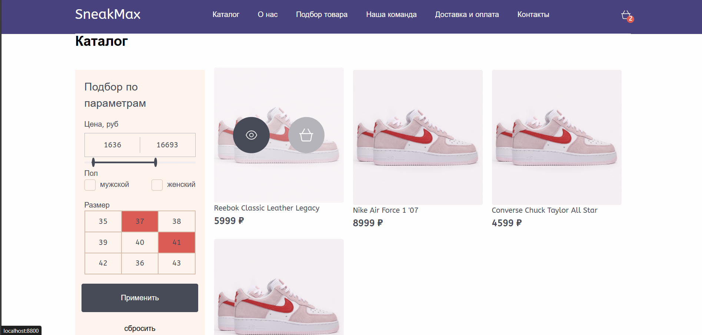
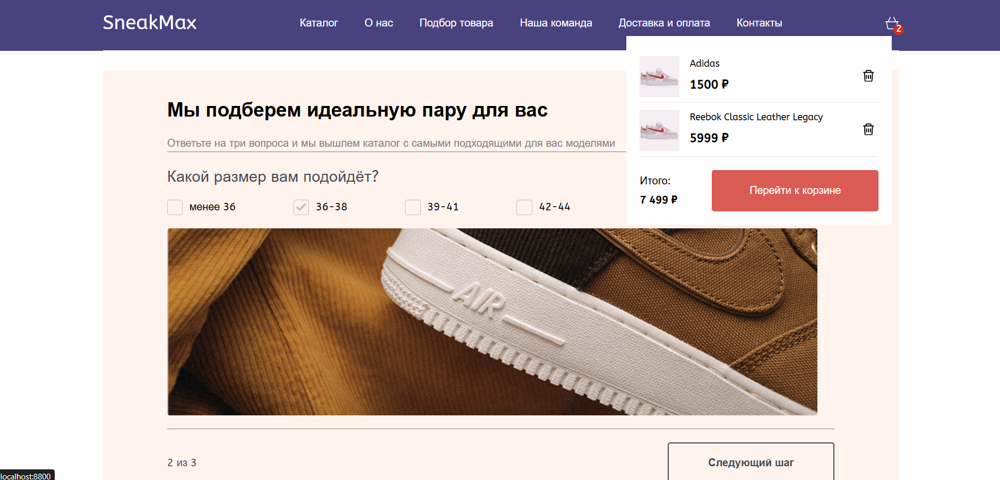
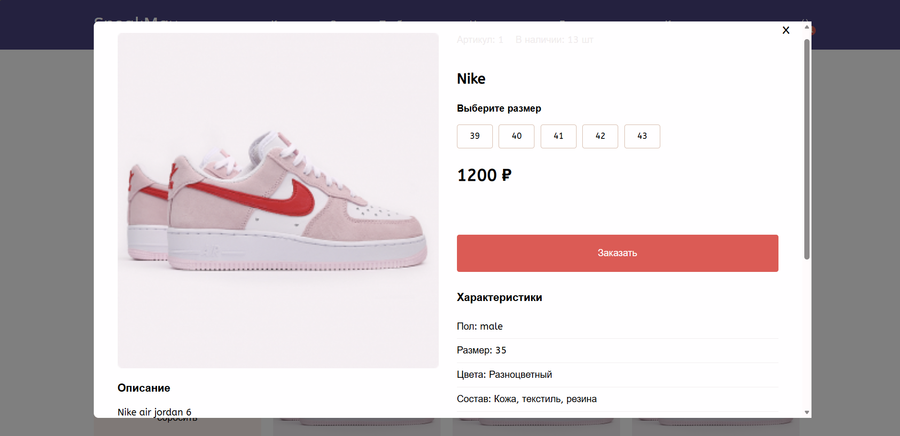

# Shoes Shop - Интернет-магазин кроссовок

Fullstack SPA для продажи обуви с динамической загрузкой товаров и корзиной покупок

> ## Функциональность

- Парсинг csv-файла с товарами и последующая динамическая загрузка на клиент через REST API
- Система корзины с сохранением в localStorage
- Фильтрация и поиск товаров
- Адаптивный дизайн для мобильных устройств

> ## Технологии

HTML, CSS, SCSS, JavaScript, NodeJSl, PostgreSQL

> ## Установка зависимостей

- cd clone https://github.com/gutguty/shoesShop.git
- npm start

> ## Скриншоты интерфейса

### Hero-секция (hero.png)  

### Каталог товаров (catalog.png)

### Корзина (basket.png)

### Модальное окно товара (modal.png)

### Форма заказа (order.png)

